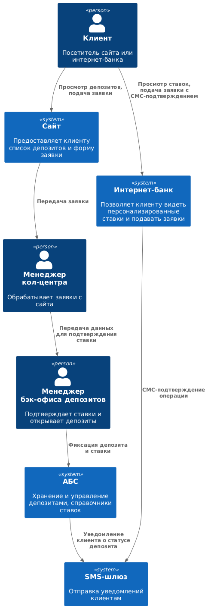

### **Название задачи:** 
Концептуальная архитектура открытия депозитов MVP

### **Автор:**
Бекурин Г.A.

### **Дата:**
2025-08-24

### **Функциональные требования**
Опишите здесь верхнеуровневые Use Cases. Их нужно оформить в виде таблицы с пошаговым описанием:

|**№**|**Действующие лица или системы**|**Use Case**|**Описание**|
| :-: | :- | :- | :- |
| 1 | Клиент (сайт) | Просмотр депозитов | Клиент видит список доступных депозитов с актуальными ставками и минимальными условиями |
| 2 | Клиент (сайт) | Подача заявки на депозит | Клиент оставляет Ф.И.О. и телефон; данные передаются в кол-центр через защищенный канал |
| 3 | Менеджер кол-центра | Обработка заявки с сайта | Менеджер изучает заявку, может предложить особые условия; после звонка клиенту требуется идентификация в отделении |
| 4 | Клиент (интернет-банк) | Просмотр депозитов и персонализированных ставок | Клиент видит актуальные ставки и персонализированные предложения по депозитам |
| 5 | Клиент (интернет-банк) | Подача заявки на депозит | Клиент указывает счет и сумму депозита; операция подтверждается СМС-кодом |
| 6 | Менеджер бэк-офиса депозитов | Подтверждение ставки и открытие депозита | Менеджер обрабатывает заявку, подтверждает размер ставки и открывает депозит в АБС |
| 7 | АБС | Хранение данных о депозитах | Все сведения о депозитах фиксируются в АБС; возможно обновление ставок через интерфейс бэк-офиса |
| 8 | SMS-шлюз | Уведомление клиента | После подтверждения ставки и открытия депозита клиент получает СМС-уведомление |

### **Нефункциональные требования**
Опишите здесь нефункциональные требования и архитектурно значимые требования.

|**№**|**Требование**|
| :-: | :- |
| 1 | Доступность сервисов интернет-банка и кол-центра 24/7 |
| 2 | Отклик по клиентским операциям в миллисекундах |
| 3 | Шифрование данных при передаче (TLS/HTTPS) |
| 4 | Надежность обработки заявок; синхронизация между интернет-банком, сайтом, кол-центром и АБС |
| 5 | Поддержка существующих технологий банка: MS SQL, Oracle, существующие библиотеки |
| 6 | Возможность горизонтального масштабирования интернет-банка и кол-центра |
| 7 | Система уведомлений через СМС, без доработки ядра |
| 8 | Соответствие системе дизайна банка (бренд, цвета, UX) |
| 9 | Возможность документирования архитектуры для дальнейшего расширения MVP |

### **Решение**
Приведите диаграммы контекста и контейнеров в модели C4. Опишите там основные компоненты и интеграции всех элементов решения. 

### Диаграмма контекста (C4)

### Диаграмма контейнеров (C4)

**Логика принятия решений по технологиям:**
- Используем существующие СУБД (MS SQL, Oracle) для хранения ставок и депозитов  
- Шифрование всех клиентских данных через TLS/HTTPS  
- SMS-оповещения через существующий шлюз  
- Горизонтальное масштабирование интернет-банка и кол-центра; вертикальное — для АБС  
- MVP минимизирует изменения в АБС, основная логика — в бэк-офисе и интеграционном слое  

### **Альтернативы**
Опишите здесь наиболее важные альтернативные решения.

|**Вариант**|**Описание**|**Недостатки / Риски**|
|------------|-----------|---------------------|
| Прямой доступ интернет-банка к АБС | Интернет-банк напрямую взаимодействует с АБС для подачи заявок | Риск перегрузки базы данных, снижение надежности, сложность масштабирования |
| Использование микросервисной архитектуры сразу для всей системы | Полная переработка интернет-банка и бэк-офиса под микросервисы | Сложно реализовать за MVP, высокие затраты, недостаточная экспертиза команды |
| Сохранение ставок только в XLS-файлах | Минимальная доработка, сотрудники используют текущие файлы | Ограниченная надежность, невозможность персонализации, сложность интеграции с интернет-банком |

**Недостатки, ограничения, риски:**
- Зависимость от АБС, возможные задержки при высокой нагрузке  
- Ограниченная автоматизация MVP, требуется участие менеджеров  
- Ограниченная интеграция со сторонними сервисами до будущих версий  
- Необходимо контролировать безопасность передачи данных  
