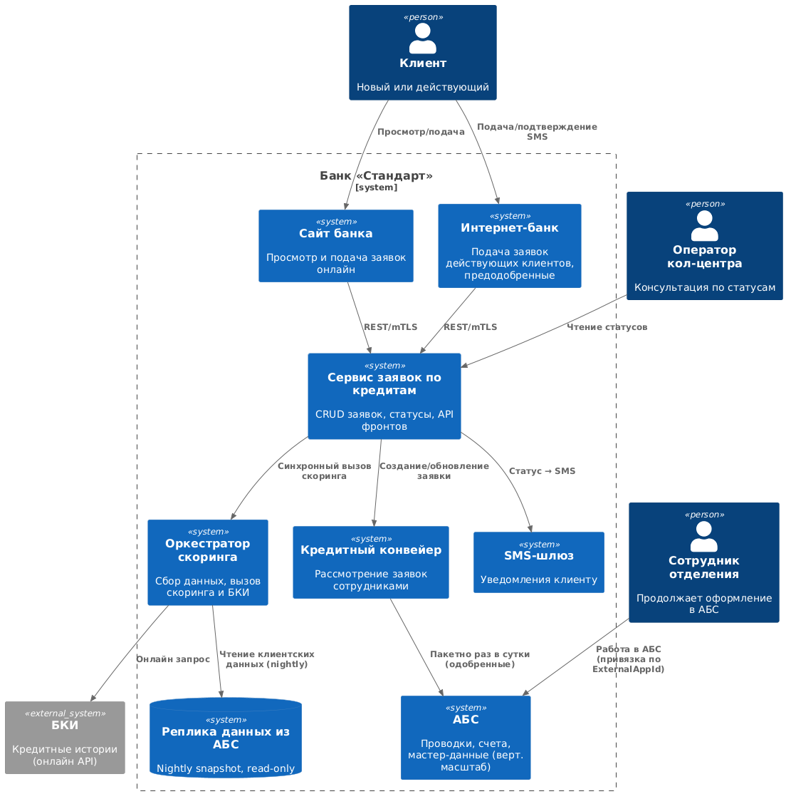
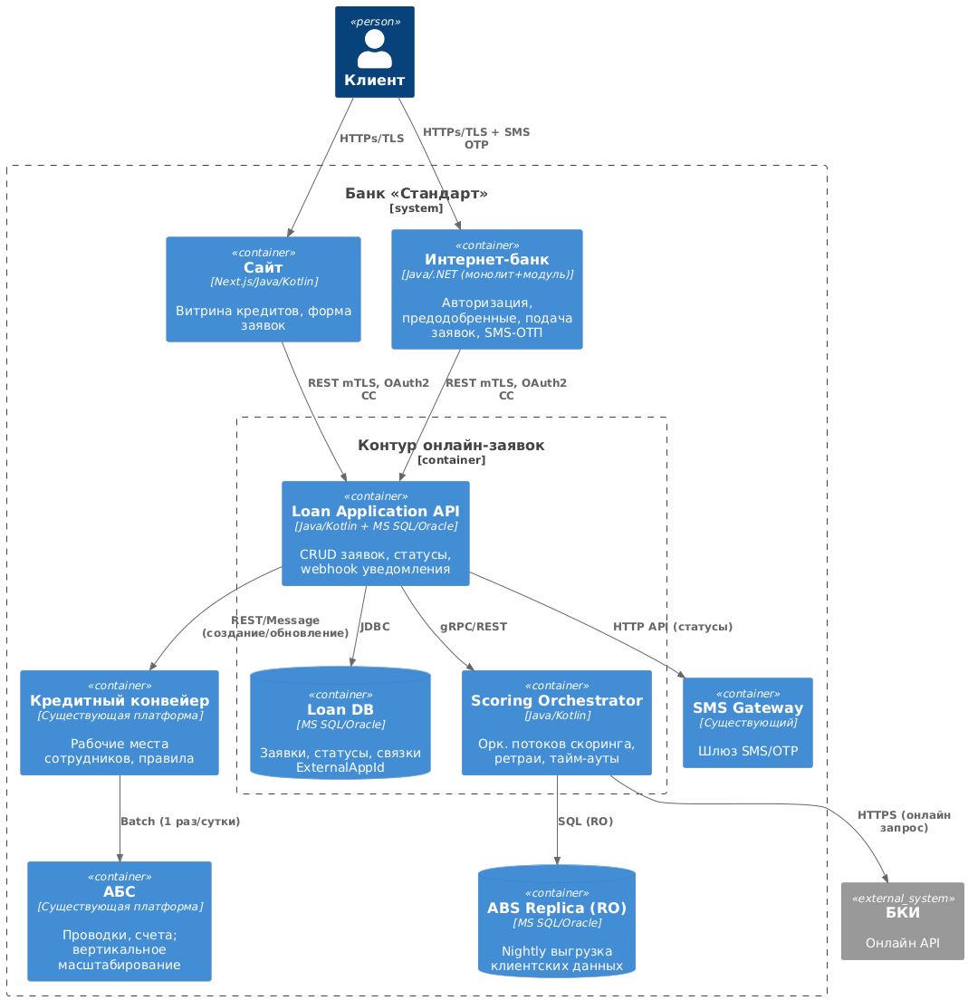

### **Название задачи:** 
Онлайн-подача кредитной заявки в рамках одного года после MVP

### **Автор:**
Бекурин Г.A.

### **Дата:**
2025-08-24

---

### **Функциональные требования**

|**№**|**Действующие лица или системы**|**Use Case**|**Описание**|
| :-: | :- | :- | :- |
| 1 | Клиент | Подать онлайн-заявку | Клиент заходит в интернет-банк или мобильное приложение и заполняет заявку на кредит. |
| 2 | Интернет-банк / Мобильное приложение | Передача заявки | Отправка заявки в АБС банка через API. |
| 3 | АБС | Регистрация заявки | Сохранение заявки и подготовка к передаче в Кредитный конвейер. |
| 4 | Кредитный конвейер | Обработка заявки | Раз в сутки импорт заявок из АБС, запуск бизнес-процесса скоринга. |
| 5 | Система скоринга | Онлайн-проверка клиента | В момент обработки заявки — вызовы API Бюро кредитных историй и внутренних источников данных. |
| 6 | Кредитный менеджер | Рассмотрение заявки | Принятие финального решения с учётом скоринга и условий клиента. |
| 7 | АБС | Финализация | При одобрении — перевод заявки в статус «Одобрено», зачисление средств на счёт. |

---

### **Нефункциональные требования**

|**№**|**Требование**|
| :-: | :- |
| 1 | Высокая доступность (99,9%) для онлайн-заявок. |
| 2 | Время отклика интернет-банка ≤ 3 секунд. |
| 3 | Безопасность передачи данных — TLS 1.3, шифрование персональных данных в БД. |
| 4 | Масштабируемость интернет-банка и конвейера под рост онлайн-заявок. |
| 5 | Поддерживаемость — единый API для интеграции АБС и конвейера. |
| 6 | Соответствие требованиям ЦБ РФ по хранению и обработке данных. |

---

### **Решение**

#### Диаграмма контекста (C4, уровень 1)

#### Диаграмма контейнеров (C4, уровень 2)

**Обоснование решений:**
- Добавлен онлайн-канал (интернет-банк / мобильное приложение), который интегрируется с АБС через API.  
- АБС остаётся главным хранилищем заявок, но раз в сутки выгружает их в конвейер.  
- Скоринг вызывается онлайн при рассмотрении заявки, что повышает точность данных.  
- Безопасность обеспечивается API Gateway, TLS и шифрованием данных.  

---

### **Альтернативы**
1. **Синхронная интеграция ABS ↔ Кредитный конвейер через API**  
   - + Уменьшает задержки передачи заявок.  
   - – Требует серьёзной доработки АБС и может повлиять на стабильность.  

2. **Промежуточная очередь (Kafka/RabbitMQ)**  
   - + Реальное время, надёжная доставка сообщений.  
   - – Увеличение сложности архитектуры.  

---

**Недостатки, ограничения, риски**
- Суточная задержка при передаче заявок из АБС в Кредитный конвейер (если не выбрать API или очередь).  
- Зависимость от внешнего Бюро кредитных историй: риск недоступности API.  
- Рост нагрузки на интернет-банк потребует масштабирования инфраструктуры.  
- Повышенные требования к кибербезопасности.  
